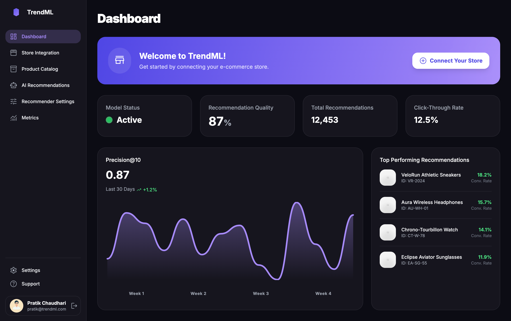
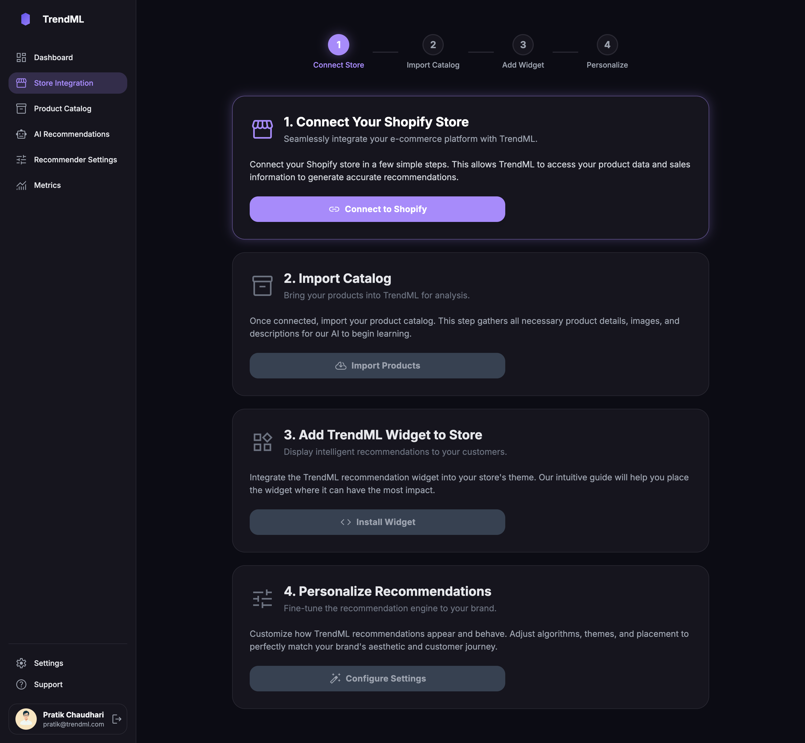
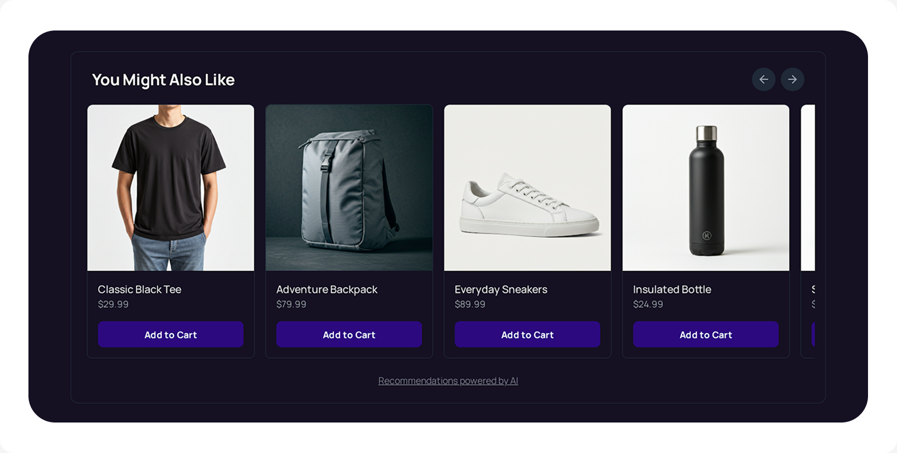
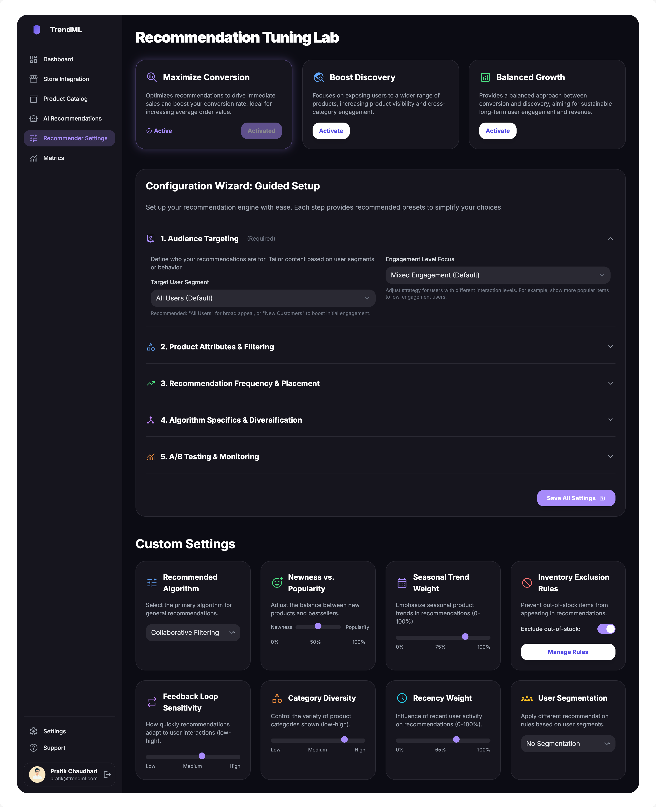
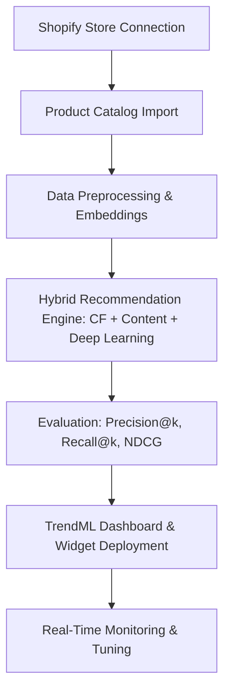

# AI-Powered Personalized Product Recommendation Engine for Shopify

## Core Idea
In modern e-commerce, personalization isn’t optional—it’s expected. Customers want stores that understand their preferences, anticipate their needs, and surface relevant products in real-time.  

**TrendML** is a Shopify app that transforms this vision into reality:  
- Connect your Shopify store in seconds  
- Import your product catalog  
- Add the TrendML widget to your storefront  
- Access an AI-powered dashboard to tune and monitor recommendations  

> TrendML acts as your **AI Assistant Analyst**, turning hidden patterns in your store data into actionable, revenue-driving recommendations.

## Project Overview
TrendML is a **hybrid AI recommendation system** combining collaborative filtering, content-based filtering, and deep learning.  

**Key Goals:**  
- ✅ Boost conversion by showing the right products to the right users  
- ✅ Drive product discovery and cross-selling  
- ✅ Provide explainable, actionable insights via a beautiful dashboard  

## Tech Stack
- **Programming:** Python, Node.js  
- **ML & AI:** TensorFlow, Scikit-Learn, Surprise  
- **Database:** PostgreSQL  
- **Data Handling:** Pandas, NumPy  
- **Visualization & UI:** Streamlit for dashboard mockups  
- **Deployment:** Flask / FastAPI backend, Shopify app integration  

## How It Works
TrendML is designed as a **plug-and-play Shopify app**. Below is the workflow from store connection to live recommendations, integrated with UI mockups.

> 1. **TrendML Dashboard**: Overview of store performance, recommendation insights, and metrics.

> 2. Connect Your Shopify Store & Import Product Catalog
Merchants connect their store via OAuth and API keys, then import product metadata, inventory, and categories for AI training.

  

> 3. Add TrendML Widget
Display AI-powered recommendations on homepage, collections, and product pages.

> 4. Recommendation Tuning Lab
Monitor metrics, tune strategies, and configure the recommendation engine:

- **Maximize Conversion:** Focus on immediate sales  
- **Boost Discovery:** Expose users to a wider range of products  
- **Balanced Growth:** Sustainable balance between conversion & discovery  

- Audience targeting  
- Product attributes & filtering  
- Recommendation frequency & placement  
- Algorithm diversification  
- A/B testing & monitoring

> 5. Sample Store Using TrendML
See recommendations in action on a Shopify storefront powered by TrendML.

## System Workflow Diagram

## Notes

- **Shopify Store Integration:** Connect merchant Shopify stores via OAuth and API keys. Automatically fetch product catalog, inventory, and categories.  
- **Preprocessing Pipeline:** Clean and normalize product and interaction data, handle missing values, generate embeddings for AI models.  
- **Baseline Models:** User-User and Item-Item Collaborative Filtering to provide initial recommendations.  
- **Hybrid Model Training:** Combines collaborative filtering, content-based features, and TensorFlow deep learning models for advanced personalized recommendations.  
- **Evaluation Metrics:** Precision@k, Recall@k, NDCG, and MAP to measure recommendation quality.  
- **UI Mockups / Dashboard:** Streamlit-powered interactive dashboard allows merchants to:  
  - Visualize AI recommendations  
  - Tune recommendation strategies (conversion, discovery, balanced growth)  
  - Monitor metrics and performance  
  - Configure audience targeting, product filtering, algorithm specifics, and A/B testing  
