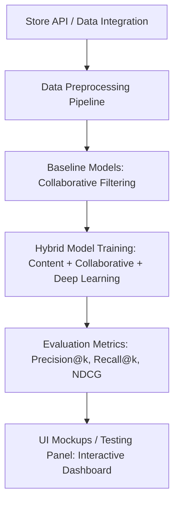

# 🛍️ TrendML — AI-Powered Personalized Product Recommendation Engine
- trendML is a shopify app what you add in your shopify store.
- trendml connects to your shopify store, and you can access trendml's own dashboard (store owner admin panel)
- trendml uses data like customer browser history, and other factors and recommends tghe customer products that are impulse buys.

## 🔮 Core Idea
In today’s e-commerce landscape, personalization is the standard. Customers expect platforms to understand their preferences, anticipate their needs, and deliver relevant products in real time.  

**TrendML** is an AI-powered system that connects to prebuilt e-commerce stores (like Shopify, WooCommerce, Magento) to automatically fetch product catalogs and user interaction data. It generates real-time, explainable product recommendations that can be integrated directly into the store or displayed via a testing dashboard.

> Yet, that is exactly what we ask of online retailers: they have huge product catalogs and massive user data, but hidden patterns remain in the noise.  
> TrendML acts as your **AI Sous Analyst**, automatically analyzing store data and delivering actionable recommendations.

## 🎯 Project Overview
TrendML is a hybrid recommendation system combining collaborative filtering, content-based filtering, and TensorFlow deep learning models.  

**Key Goals:**
- ✅ Improve recommendation precision and recall over traditional rule-based methods  
- ✅ Adapt dynamically to evolving user behaviors and product trends  
- ✅ Provide real-time, explainable recommendations for transparency and trust  

**Data Sources / Usage:**
- Product metadata and transaction logs from connected e-commerce stores (mocked for GitHub demo)  
- Open datasets or simulated marketplaces for development and testing  
- Data is preprocessed and normalized for model input (ratings, embeddings, categories, features)  

## ⚙️ Tech Stack
- **Programming:** Python 🐍  
- **ML Libraries:** Scikit-Learn, TensorFlow, Surprise  
- **Database:** PostgreSQL  
- **Data Handling:** Pandas, NumPy  
- **Visualization:** Matplotlib, Seaborn, Plotly  
- **Deployment Ready:** Flask / FastAPI  
- **Frontend / UI Mockups:** Streamlit (interactive dashboards)  

## 🧩 System Workflow

### Notes
- **Store API / Data Integration:** Mocked integration with example e-commerce stores  
- **Preprocessing Pipeline:** Normalize ratings, handle missing data, generate embeddings  
- **Baseline Models:** User-User, Item-Item Collaborative Filtering  
- **Hybrid Model Training:** Combines embeddings with TensorFlow deep learning models  
- **Evaluation:** Precision@k, Recall@k, NDCG, MAP  
- **UI Mockups / Testing Panel:** Streamlit dashboard shows recommended products interactively

